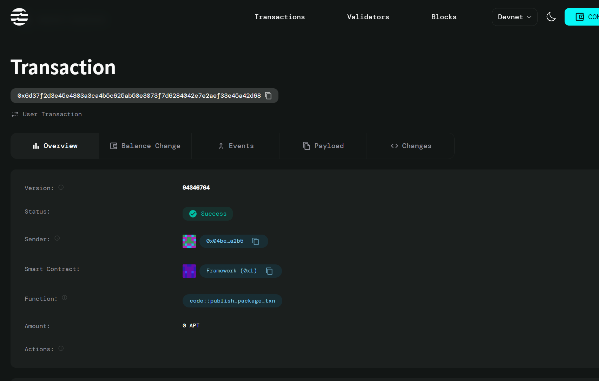

# 🔐 **Permission Expiry Smart Contract dApp**

## **⭐ Project Title**

# **Permission Expiry Management System on Aptos Blockchain**

## **⭐ Project Description**

The Permission Expiry dApp is a revolutionary smart contract built with Move on the Aptos blockchain that provides secure, automated management of time-based permissions. It enables decentralized applications to grant, track, and automatically revoke permissions after a specified expiration time, eliminating manual overhead and enhancing security.

## **⭐ Project Vision**

**"Revolutionizing Access Control in the Decentralized World"**

Transform how permissions are managed in Web3 by delivering a secure, user-friendly, and transparent permission management system that eliminates human error through automation and provides enterprise-grade security for all decentralized applications.

## **⭐ Key Features**

- 🕒 **Time-Based Permissions** - Automatic expiration after set duration
- 🛡️ **Multiple Access Levels** - READ, WRITE, ADMIN, SPECIAL access types
- ⚡ **Instant Revocation** - Immediate permission cancellation capability
- 💰 **Gas-Optimized** - Minimal transaction costs with Move language efficiency
- 📊 **Real-Time Monitoring** - Live permission status tracking and validation
- 🆓 **Gas-Free Views** - Zero cost for permission status queries
- 🔒 **Admin Controls** - Secure administrative functions with proper access control
- 📝 **Event Logging** - Comprehensive audit trails for all permission activities

## **⭐ Future Scope**

### **🌟 Short-term Goals (3-6 months)**

- 🌐 **Multi-Chain Support** - Extend to Ethereum, Polygon, BSC networks
- 👥 **Role-Based Access Control** - Advanced permission hierarchies and roles
- 📱 **Mobile Application** - Dedicated mobile app for easy permission management
- 📈 **Analytics Dashboard** - Permission usage insights and detailed reporting

### **🚀 Long-term Vision (6-12 months)**

- 🏛️ **DAO Integration** - Governance-based permission management
- 🎨 **NFT-Gated Permissions** - Token-based access control mechanisms
- � **Cross-Chain Bridge** - Interoperable permissions across blockchains
- 🤖 **AI-Powered Recommendations** - Intelligent permission suggestions

---

## **🚀 Deployment Information**

- **📍 Contract Address:** `0x6d37f2d3e45e4803a3ca4b5c625ab50e3073f7d6284042e7e2aef33e45a42d68`
- **🌍 Network:** Aptos Devnet

## **💻 Quick Start**

```bash
# Clone the repository
git clone https://github.com/chaitanya73825/permission_expiry.git
cd permission_expiry

# Install dependencies
npm install

# Start development server
npm run dev
```

## **📸 Screenshots**

<div align="center">

\_🚀 Permission Expiry dApp - Modern dark theme interface with secure Aptos blockchain integration\_


</div>

---

## **🤝 Contributing**

We welcome contributions! Feel free to submit pull requests, report bugs, or suggest new features.

## **📜 License**

This project is licensed under the MIT License.

---

**🔥 Built with ❤️ on Aptos Blockchain • Securing the Future of Decentralized Access Control 🚀**
